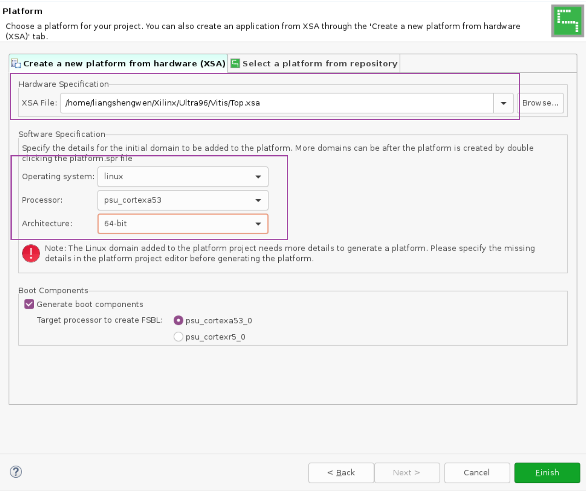
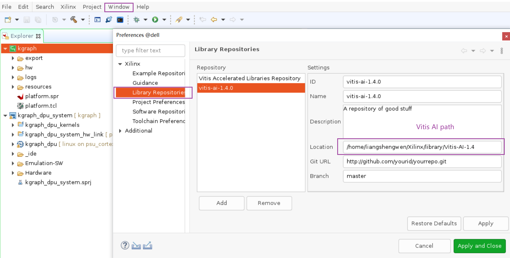

<!--
 * @Author: Shengwen Liang
 * @Date: 2022-03-22 16:18:31
 * @LastEditTime: 2022-03-29 17:08:49
 * @LastEditors: Shengwen Liang
 * @Description: 
 * @FilePath: \AI-enabled-graph-vector-search-on-Xilinx-KV260\README.md
-->
# AI-driven Image Similarity Search on KV260
This project combines the Xilinx DPU accelerator and customized graph search accelerator to construct an AI-enable vector search engine on KV260 for building a ***Image Similarity Search*** applications. 

# Overview
The AI-driven Image Similarity Search has become an indispensable part in various scenarios including google search engine, taobao search engine, and recommendation systems. As shown in Figure.1, it contains two stages: feature embedding vector extraction that obtains a vector by performing deep neural network, and the vector search that aims to obtain the nearest instance from large-scale croups. The Image Similarity Search application on edge platforms usually asks for real-time search and low energy consumption. Thereby, this project aims to combine the Xilinx DPU accelerator and customized graph search accelerator to construct an AI-driven Image Similarity Search engine and applications on KV260. User can access Image Similarity application via Internet.  
<p align="center">
  
</p>

# Hardware
1. Xilinx KV260
2. TP-LINK Router

# Software
1. Caffe
2. Vitis 2021.1
3. Vivado 2021.1
4. KGraph
6. Docker

# Customized Graph Search Engine Design
<p align="center">
  
</p>

The basic idea of graph-based vector search methods is based
on the concept of a neighbor’s neighbor is also likely to be a neighbor. As shown in Algorithm 1, given a query $q$, navigational vertices $P$, graph-based vector search starts from evaluating the distance of the navigational vertex $p \in P$ to $q$ and then conducts a search in the graph $G$ from $P$ to iteratively check neighbors’ neighbors in
the graph to update the true neighbors of the query $q$. 

<p align="center">
  
</p>

Based on the above algorithm, this project customized a graph search acceleator to perform low-latency graph search. As shown in Figure 2, the graph search accelerator mainly consists of graph index buffer, the bitmap filter module, hamming distance computing module, and result buffers. The controller module obtains the uncheck vertex from result buffer (line 7 in algorithm 1) to inform CDMA module read the edge list information from DRAM to graph index buffer.
In addition, in order to simplify the data reading process and the design of the controller module, as shown in the left side of Figure 2, we choose to merge the graph index structure with the feature vector and place them into the DRAM memory. During the execution of the graph search accelerator,  we can acquire the feature vector information while reading the neighbor information.

# Deployment Instruction
We present the overall deployment process in terms of both hardware and software aspect. 

The hardware mainly focuses on (1) how to use VIVADO to integrate a custom graph search accelerator and build a *Platform* to generate the corresponding XSA file; (2) how to use Vitis to integrate Xilinx's DPU neural network accelerator based on XSA file.

The software side mainly includes (1) how to train, quantize, and deploy googlenet neural network models to DPU; (2) how to construction a graph index for the graph search accelerator; and (3) how to develop graph search applications to enable user access from the Internet.

<p align="center">
  
</p>

## Hardware 
As shown in Figure 3, the hardware development mainly contains two steps:
### Step-1. Develop Hardware platform via Vivado
**1.1 Launch Vivado and Create a Vivado Project**
<p align="center">
  
</p>

```bash
source <Vitis_Install_Directory>/settings64.sh
vivado &
```
Select Kria KV260 Vision AI Starter Kit
Click Connections, select Vision AI Starter Kit carrier card, click OK.

**1.2 Add MPSoC, Clocking Wizard, and reset IP**
<p align="center">
  
</p>

**1.3 Intergate graph search accelerator**
<p align="center">
  
</p>
<p align="center">
  
</p>
  we also provide the verilog code of the graph search accelerator, you can check it in XX file.

**1.4 Export Hardware XSA**
<p align="center">
  
</p>

* Clock Platform Setup Tab
* Select AXI port, Clock, Interrupt Tab
* Enable the port and interface used by DPU
* Export Hardware XSA

### Step-2. Create Vitis platform
2.1 Launch Vitis and Create Vitis platform project based on Vivado hardware XSA file
<p align="center">
  
</p>

```bash 
source <Vitis_Install_Directory>/settings64.sh
vitis &
```

2.2 Create Vitis DPU application project based on Vitis platform project
<p align="center">
  
</p>

* Add Vitis-AI repository
* Download the Vitis-AI cross compile environment including library and sdk
```
wget https://www.xilinx.com/bin/public/openDownload?filename=sdk-2021.1.0.0.sh -O sdk-2021.1.0.0.sh
wget https://www.xilinx.com/bin/public/openDownload?filename=vitis_ai_2021.1-r1.4.0.tar.gz -O vitis_ai_2021.1-r1.4.0.tar.gz
chmod +x sdk-2021.1.0.0.sh
./sdk-2021.1.0.0.sh
tar -xzvf vitis_ai_2021.1-r1.4.0.tar.gz -C ./sysroots/cortexa72-cortexa53-xilinx-linux/
```
Noted that the Xilinx also provide a host cross compiler setup.sh to configure the above environment. 
```
wget https://raw.githubusercontent.com/Xilinx/Vitis-AI/1.4/setup/mpsoc/VART/host_cross_compiler_setup.sh
./host_cross_compiler_setup.sh
```
<p align="center">
  
</p>

* Add DPU IP on our application project
<p align="center">
  
</p>

* Update DPU configuration for KV260
* Add DPU IP on our application project
<p align="center">
  
</p>

```
Since the KV260 provides hardware resources that need to be partially allocated to the graph search accelerator, the remaining hardware resources allow us to configure the DPU to B1152. this problem can be solved by using a SOM board with more resources.

/*====== Architecture Options ======*/
`define B1152 
`define URAM_ENABLE 
`ifdef URAM_ENABLE
    `define def_UBANK_IMG_N          5
    `define def_UBANK_WGT_N          17
    `define def_UBANK_BIAS           1
`elsif URAM_DISABLE
    `define def_UBANK_IMG_N          0
    `define def_UBANK_WGT_N          0
    `define def_UBANK_BIAS           0
`endif
`define DRAM_DISABLE 
`ifdef DRAM_ENABLE
    `define def_DBANK_IMG_N          1 
    `define def_DBANK_WGT_N          1
    `define def_DBANK_BIAS           1
`elsif DRAM_DISABLE
    `define def_DBANK_IMG_N          0
    `define def_DBANK_WGT_N          0
    `define def_DBANK_BIAS           0
`endif
`define RAM_USAGE_LOW
`define CHANNEL_AUGMENTATION_ENABLE
`define DWCV_ENABLE
`define POOL_AVG_ENABLE
`define ELEW_MULT_DISABLE
`define RELU_LEAKYRELU_RELU6
`define DSP48_USAGE_HIGH 
`define LOWPOWER_DISABLE
`define MPSOC
```

* Configuration DPU clock and connectivity
<p align="center">
  
</p>

---

## Software

The software consists of two parts, offline stage and online stage. In the offline phase, as shown in Figure X, there are 5 parts. We need to first train the neural network, then quantize it, compile it, and deploy it to the DPU. Then, we generate the corresponding feature vector for each image in the image dataset (hash coding is used in this project) using DPU on KV260 board, and build the graph index based on the hash coding of the images using kgraph software. In order to conform to the input format of the graph search accelerator, we fuse the hash coding with the graph index to generate a binary file that conforms to the graph search accelerator. More details about offline stage and online stage are shown as follows:

### OFFLINE
------

<p align="center">
  
</p>

### Step-3. Train googlenet neural network
3.1 Neural network architecture
<p align="center">
  
</p>

we adopt deep hashing methods to achieve effective yet condensed data representation. Fig exemplifies a deep hashing architecture, Hash-MinigoogleNet, where a hash layer follows the last layer of minigooglenet to project the data feature learned from googlenet into the hash space, and the generated hash code can be directly used to index the relevant data structures and get rid of the complex data preprocessing stage.

3.2 how to train the network 

we can leverage train.sh file to train the hash-minigooglenet using CIFAR-10 dataset

```bash
cd caffe/example/CIFAR-10/
./train.sh
```

When the training step is done, the training log file and caffemodel are generated. From log file, we can get the accuracy of model. 

<p align="center">
  
</p>

### Step-4. Quantize googlenet neural network
From Step-3, we can get the hashminigooglenet caffemodel, and we can rename it to float.caffemodel and rename prototxt to float.prototxt. Meanwhile, we need prepare the calibration dataset for vitis ai quantizer.

```
docker attach "vitis-ai-gpu:1.4.0"
./quantization.sh
```
When the quantization is down, deploy.prototxt and deploy.caffemodel are generated in quantize_results file.

<p align="center">
  
</p>

### Step-5. Compile googlenet neural network
5.1 Prepare arch.json file of customized DPU architecture

Before compile the deploy.caffemodel generated from Step-4, we need prepare the proper DPU configuration file `arch.json` from the vitis project ```${Vitis_project_path}/kgraph_dpu_system_hw_link/Hardware/dpu.build/link/vivado/vpl/prj/prj.gen/sources_1/bd/design_1/ip/design_1_DPUCZDX8G_1_0```

In our project, the arch.json file for KV260 DPU with B1152 configuration has content:

```
{"fingerprint":"0x1000020F6012203"}
```

5.2 Compile neural network 
From Step-4, we can get the deploy.prototxt and deploy.caffemodel. Based the arch.json, we can compile hash-minigooglenet model for DPU.

Due to the sigmoid layer cannot deploy on DPU and the fully connected layer does not use in inference stage, we need remove the sigmoid layer and FC layer in deploy prototxt. Then we run `compile.sh` to get the .xmodel file.

```
./compile.sh
```

When compiler is done, the googlenet.xmodel is generated and we can deploy this model on DPU. 

### Step-6. Generate hash code using Xilinx DPU

6.1 development

In this step, we deploy googlenet.xmodel on DPU using KV260 board. Meanwhile, we leverage DPU to extract the hash code of images in CIFAR-10 dataset. The code for this step:

```C++
void runDPU(std::unique_ptr<vart::Runner> &runner, std::string image_file_name) {
    auto input_tensors = runner->get_input_tensors();
    auto output_tensors = runner->get_output_tensors();

    // create runner and input/output tensor buffers;
    auto input_scale = vart::get_input_scale(input_tensors);
    auto output_scale = vart::get_output_scale(output_tensors);

    // prepare input tensor buffer
    CHECK_EQ(input_tensors.size(), 1u) << "only support googlenet model";
    auto input_tensor = input_tensors[0];
    auto height = input_tensor->get_shape().at(1);
    auto width = input_tensor->get_shape().at(2);
    auto input_tensor_buffer = create_cpu_flat_tensor_buffer(input_tensor);

    // prepare output tensor buffer
    CHECK_EQ(output_tensors.size(), 1u) << "only support googlenet model";
    auto output_tensor = output_tensors[0];
    auto output_tensor_buffer = create_cpu_flat_tensor_buffer(output_tensor);

    uint64_t data_in = 0u;
    size_t size_in = 0u;
    std::tie(data_in, size_in) = input_tensor_buffer->data(std::vector<int>{0, 0, 0, 0});

    cv::Mat input_image = read_image(image_file_name);
    CHECK(!input_image.empty()) << "cannot load " << image_file_name;
    int8_t* data = (int8_t*)data_in;
    cv::Mat image2 = cv::Mat(height, width, CV_8SC3);
    cv::resize(input_image, image2, cv::Size(height, width), 0, 0, cv::INTER_NEAREST);
    for (int h = 0; h < height; h++) {
      for (int w = 0; w < width; w++) {
        for (int c = 0; c < 3; c++) {
        	float tmp = ((float)image2.at<cv::Vec3b>(h, w)[c]) - mean[c];
          	data[h*width*3+w*3 + c] = (int8_t) ( tmp * input_scale[0]); //in BGR mode
        }
      }
    }
    auto v = runner->execute_async({input_tensor_buffer.get()}, {output_tensor_buffer.get()});
    auto status = runner->wait((int)v.first, -1);
    CHECK_EQ(status, 0) << "failed to run dpu";
    generateHash(output_tensor_buffer.get(), output_scale[0]);
}

int main(int argc, char* argv[]) {
    const auto image_file_name = std::string(argv[1]);  // std::string(argv[2]);
    const auto model_name      = std::string(argv[2]);
    auto runner = InitDPU(model_name);

    const std::string cifar10_path = "../cifar10/";
    ReadImagePath(cifar10_path + "train.txt");
    for(int i = 0; i < images.size(); i++) {
    	runDPU(runner, cifar10_path + images[i]);
    }
    WriteHashCodeToFile("train_hash_code.txt");
    return 0;
}

static void generateHash (vart::TensorBuffer* tensor_buffer, float scale) {
	auto sigmoid_input = convert_fixpoint_to_float(tensor_buffer, scale);
	std::cout << "output size = " << sigmoid_input.size() << std::endl;
	float *sigmoid = new float[48];
	int i = 0;
	for(auto val : sigmoid_input) {
		sigmoid[i] = 1. / (1. + exp(-val));
		i++;
	}
	uint64_t hashcode = 0;
	int *Hash_code = new int[48];
    for (int i=0; i<48; i++)
    {
    	Hash_code[i] = sigmoid[i] > 0.5? 1 : 0;
    	hashcode = sigmoid[i]>0.5? (hashcode | ((uint64_t)1 << (63-i))): ((hashcode & (~((uint64_t)1 << (63-i)))));
    }
    printf("val = %#018"PRIx64"\n", hashcode);
    hash_code.emplace_back(int_array_to_string(Hash_code, 48));
}
```

6.2 Prepare the files for KV260 board

Since Kria SOM uses xmutil to load applications, we need prepare realted file to deploy our application. 

* generate **shell.json**
```
{
  "shell_type" : "XRT_FLAT",
  "num_slots": "1"
}
```

* generate **system.dtbo**

  - Open `pl.dtsi`
  - update `firmware-name = "system.bit.bin"`
  - complile pl.dtsi with command `dtc -@ -O dtb -o step4_validate/vadd.dtbo step2_petalinux/dt_output/pl.dtsi`
* generate **system.bit.bin**
```
cd kgraph_dpu_system/Package
echo 'all:{system.bit}'>bootgen.bif 
bootgen -w -arch zynqmp -process_bitstream bin -image bootgen.bif
```

6.3 copy the files to the board
In order to run the application, we need copy `dpu.xclbin, googlenet.xmodel, kgraph_dpu, shell.json, system.bit system.bit.bin, system.dtbo` to KV260 board. Meanwhile, we also need copy the library related to DPU. 

```
#Running on KV260 board
sudo mkdir /lib/firmware/xilinx/kgraph_dpu
cd /home/petalinux/kgraph_dpu
cp system.dtbo system.bit.bin shell.json /lib/firmware/xilinx/kgraph_dpu
sudo xmutil listapps
sudo xmutil unloadapp
sudo xmutil loadapp kgraph_dpu
```

6.4 Run kgraph_dpu application for hash code extraction on KV260

 * Run kgraph_dpu
 ```
 #Running on target board
 chmod +x kgraph_dpu
 env LD_LIBRARY_PATH=samples/lib XLNX_VART_FIRMWARE=dpu.xclbin ./kgraph_dpu
 ```
When application is done, the `train_hash_code.txt` file is generated. 

### Step-7. Generate a graph index for vector search
The customized graph search accelerator needs a graph index to perform graph search. Thereby, this step aims to generate graph index using `train_hash_code.txt` based on modified [kgraph](https://github.com/aaalgo/kgraph) framework. 

dpu_knn_hamming.cpp
```C++
 Matrix<uint64_t> hash_code(50000,1);
 Matrix<uint64_t> query_code(10000,1);
 vector<int> hamming_result;
 vector<std::string> database_label;
 vector<std::string> query_label;
 ifstream infile_database,infile_database_label,infile_query,infile_query_label;
 infile_database.open("kv260_train_hash_code.txt");
 infile_database_label.open("../data/cifar10/train-label.txt");
 infile_query.open("kv260_test_hash_code.txt");
 infile_query_label.open("../data/cifar10/test-label.txt");

unsigned dim = hash_code.dim();
VectorOracle<Matrix<uint64_t>, uint64_t const*> oracle(hash_code,
[dim](uint64_t const *a, uint64_t const *b)
{
  count_hamm ++;
  uint64_t r = popcount64d(*a^*b);
  return r;
  });
KGraph::SearchParams Sparams;
Sparams.K = 50 ;
Sparams.S = 100;
KGraph *kgraph = KGraph::create();
{
    KGraph::IndexParams params;
    params.L = 25;
    kgraph->build(oracle, params, NULL);
    kgraph->save("kv260_hamming_index",1);
}
```

```
cd kgraph
./dpu_knn_hamming
```

When `dpu_knn_hamming` is done, the graph index `kv260_hamming_index` is generated. 

### Step-8. Fuse hash code with graph index
As mentioned in **Customized Graph Search Engine Design**, we choose to merge the graph index structure with the feature vector and place them into the DRAM memory. Thereby, we need to fuse hash code with graph index to geneate a new graph index file. 

**instruction**
```
./dpu_tran_hash2bin
./kv260_bin
```
When `dpu_tran_hash2bin` and `kv260_bin` is done, the final graph index `kv260_out_end.bin` used by graph search accelerator is generated. 

**dpu_train_hash2bin.cpp**
```C++
int main()
{
  struct uint48_t hash_code[50000];
  uint32_t graph[50002][25];
  load_graph("kv260_hamming_index",graph);
  string s;
  ifstream infile_database;
  infile_database.open("kv260_train_hash_code.txt");
  int j = 0;
  while(getline(infile_database,s))
  {
    deleteAllMark(s," ");
    uint64_t result = 0LL;
    uint8_t i=0;
    for(auto iter = s.begin(); iter != s.end();++iter)
    {
        string str;
        str = *iter;
      if(str.compare("0")==0)
        {
          result = set_bit(result,(uint8_t)i,(uint8_t)0);
        }
        else if(str.compare("1")==0)
        {
            result = set_bit(result,(uint8_t)i,(uint8_t)1);
        }
        i++;
    }
    result = result >> 16;
    hash_code[j].data = result;
    j++;
  }
  ofstream out("kv260_init_input_data_test.bin",ios::binary|ios::trunc);
  vector<string> string_hash;
  for(int i =0; i<50002;++i)
  {
    for(int j=0; j<25; ++j)
    {
      stringstream ss;
      ss<<setfill('0')<<setw(sizeof(uint32_t)*2)<<std::hex<<graph[i][j];
      ss<<setfill('0')<<setw(sizeof(uint32_t)*3)<<std::hex<<hash_code[graph[i][j]].data;
      string sss  = ss.str();
      string push;
      transform(sss.begin(),sss.end(),push.begin(),::toupper);
      push = boost::to_upper_copy<std::string>(sss);
      cout<<"push="<<push<<endl;
      string com("00000000");
      string comp(sss.substr(0,8));
      cout<<comp<<endl;
      if(comp.compare(com) == 0)
      {
          cout<<push.c_str()<<" "<<endl;
      }
      cout<<sss<<" "<<endl;
      char buffer[buffersize];
      char data[datasize];
      strcpy(buffer,push.c_str());
      *(buffer+buffersize-1) = '\0';
      charArray2intArray(buffer,data);
      out.write(data,datasize);
    }
  }
  out.close();
  return 0;
}
```

**kv260_bin.c**
```C++
#include<stdio.h>
#include<stdlib.h>
int main()
{
  FILE *input = fopen("kv260_init_input_data_test.bin","rb");
  FILE *output = fopen("kv260_out_temp.bin","wb");
  FILE *outa   = fopen("kv260_out_end.bin","wb");
  if(input==NULL||output==NULL)
  {
      printf("error \r\n");
  }
  fseek(input,0L,SEEK_END);
  int length = ftell(input);
  char *weight = (char *)malloc(length);
  char *weight_new = (char *)malloc(length+50002*6);
  rewind(input);
  fread(weight,length,1,input);
  printf("length is %d ", length);
  int i,j,l;
  j=0;
  for(i=0;i<length;i++)
  {
      if(i%250==0&&(i!=0))
      {
          for(l=0;l<6;l++)
          {
              *(weight_new+j) = 0;
              j++;
          }
          *(weight_new+j) = *(weight+i);
          j++;
      }else
      {
          *(weight_new+j) = *(weight+i);
          j++;
      }
  }
  fwrite(weight_new,(length+50002*6),1,output);
  fclose(output);
  printf("\n---------stage 2------------\n");
  FILE *new_input = fopen("kv260_out_temp.bin","rb");
  fseek(new_input,0L,SEEK_END);
  int new_length = ftell(new_input);
  char *new_weight = (char *)malloc(new_length);
  char *new_weight_new = (char *)malloc(new_length);
  char *new_weight_change = (char *)malloc(new_length);
  rewind(new_input);
  fread(new_weight,new_length,1,new_input);
  for(i=0;i<new_length/4;i++)
  {
      //printf("%02x ",*(weight+i));
      *(new_weight_new+4*i) = *(new_weight+4*i+3);
      *(new_weight_new+4*i+1) = *(new_weight+4*i+2);
      *(new_weight_new+4*i+2) = *(new_weight+4*i+1);
      *(new_weight_new+4*i+3) = *(new_weight+4*i);
  }
  j=0;
  printf("length is %d ",new_length);
  for(i=0;i<new_length/4;i++)
  {
      if(i%16==0&&i!=0)
          j=j+16;
      int one = j*8 + 60 - 4*i;
      int two = j*8 + 61 - 4*i;
      int three = j*8 + 62 - 4*i;
      int four  = j*8 + 63 - 4*i;
      *(new_weight_change+4*i) = new_weight_new[one];
      *(new_weight_change+4*i+1) = new_weight_new[two];
      *(new_weight_change+4*i+2) = new_weight_new[three];
      *(new_weight_change+4*i+3) = new_weight_new[four];
  }
  fwrite(new_weight_change,new_length,1,outa);
  fclose(input);
  fclose(new_input);
  fclose(outa);
}
```

## ONLINE STAGE
----
### Step-8. Develop ***Image Similarity Search*** application

<p align="center">
  
</p>

As shown in Figure, we developed a web service based on the web framework [CROW](https://crowcpp.org/), which runs on the ARM CPU, together with the application that controls the DPU and the application that controls the graph search accelerator, to provide Image Similarity Search Services to users. User can access this service by using Web Browser on Mobile phone or Desktop computer.

<p align="center">
  
</p>

The flow of the program execution is shown in Figure. First, we save the retrieved images uploaded by the user, then invoke DPU to get the hash feature values, and subsequently, invoke the graph search accelerator to retrieve the final similarity results. Based on the similarity results, we can return the similar images to the user through the internet.

** Web framework application **
```C++
vector<string> run()
{
	uint64_t hash_code;
	vector<string> result_file_path;

	auto dpu_start = system_clock::now();

    hash_code = DPU_hash(query_image_path);

    auto dpu_end = system_clock::now();
    auto dpu_duration = (duration_cast<microseconds>(dpu_end - dpu_start)).count();
    cout << "[DPU Time]" << dpu_duration << "us" << endl;


    std::cout << "----DPU for hashcode extraction end-----" << std::endl;
    printf("hash_code = %#018"PRIx64"\n", hash_code);
    printf("hash_code = %"PRIx32"\n", (uint32_t)(hash_code>>32));
    printf("hash_code = %"PRIx32"\n", (uint32_t)(hash_code));

    unsigned int *Result_ID;

    auto kgraph_start = system_clock::now();

    Result_ID = Run_KGraph(hash_code);

    auto kgraph_end = system_clock::now();
    auto kgraph_duration = (duration_cast<microseconds>(kgraph_end - kgraph_start)).count();
    cout << "[KGraph Time]" << kgraph_duration << "us" << endl;

	for(int i=0;i<100;i++) {
		result_file_path.push_back(baseImagePath + cifar10_file_path.at(Result_ID[i]));
		printf("result=%d\n",Result_ID[i]);
	}
	delete[] Result_ID;

	return result_file_path;
}

int main(int argc, char **argv)
{
    printf("== START: AXI FPGA test ==\n");
    init();
    KGraph_Open();

    crow::SimpleApp app;
    crow::mustache::set_base(".");

    CROW_ROUTE(app, "/")
    ([]{
        crow::mustache::context ctx;
        return crow::mustache::load("./Web/a_test.html").render();
    });

    CROW_ROUTE(app, "/upload")
        .methods("GET"_method, "POST"_method)
    ([](const crow::request& req)
    {
        string tokens[6] ={"name=\"","\"; filename=\"","\"\r\n","Content-Type: ","\r\n\r\n","\r\n------WebKitFormBoundary"};
        int position[6];
        for(int i=0;i<6;i++)
        {
            position[i] = req.body.find(tokens[i]);
        }
        string name = req.body.substr(position[0]+tokens[0].length(),position[1]-position[0]-tokens[0].length());
        string filename = req.body.substr(position[1]+tokens[1].length(),position[2]-position[1]-tokens[1].length());
        string ContentType = req.body.substr(position[3]+tokens[3].length(),position[4]-position[3]-tokens[3].length());
        string filecontent = req.body.substr(position[4]+tokens[4].length(),position[5]-position[4]-tokens[4].length());
        string final_string = req.body.substr(position[5]);
        query_image_path = "/home/petalinux/userupload/" + filename;
        std::ofstream file(query_image_path, std::ios::binary);
        file.write(reinterpret_cast<const char*>(filecontent.c_str()),filecontent.length());
        file.close();
        return "aa";
    });
    app.port(50080)
        .multithreaded()
        .run();
    KGraph_Close();
    printf("== STOP ==\n");
    return 0;
}
```

** DPU code **
```C++
uint64_t runDPU(std::unique_ptr<vart::Runner> &runner, std::string image_file_name) {
    auto input_tensors = runner->get_input_tensors();
    auto output_tensors = runner->get_output_tensors();

    // create runner and input/output tensor buffers;
    auto input_scale = vart::get_input_scale(input_tensors);
    auto output_scale = vart::get_output_scale(output_tensors);

    // prepare input tensor buffer
    CHECK_EQ(input_tensors.size(), 1u) << "only support googlenet model";
    auto input_tensor = input_tensors[0];
    auto height = input_tensor->get_shape().at(1);
    auto width = input_tensor->get_shape().at(2);
    auto input_tensor_buffer = create_cpu_flat_tensor_buffer(input_tensor);

    // prepare output tensor buffer
    CHECK_EQ(output_tensors.size(), 1u) << "only support googlenet model";
    auto output_tensor = output_tensors[0];
    auto output_tensor_buffer = create_cpu_flat_tensor_buffer(output_tensor);

    uint64_t data_in = 0u;
    size_t size_in = 0u;
    std::tie(data_in, size_in) = input_tensor_buffer->data(std::vector<int>{0, 0, 0, 0});

    cv::Mat input_image = read_image(image_file_name);
    CHECK(!input_image.empty()) << "cannot load " << image_file_name;
    int8_t* data = (int8_t*)data_in;
    cv::Mat image2 = cv::Mat(height, width, CV_8SC3);
    cv::resize(input_image, image2, cv::Size(height, width), 0, 0, cv::INTER_NEAREST);
    for (int h = 0; h < height; h++) {
      for (int w = 0; w < width; w++) {
        for (int c = 0; c < 3; c++) {
        	float tmp = ((float)image2.at<cv::Vec3b>(h, w)[c]) - mean[c];
          	data[h*width*3+w*3 + c] = (int8_t) ( tmp * input_scale[0]); //in BGR mode
    	    //data_in[h*inWidth*3+w*3 +2-c] = (int8_t) ( tmp * input_scale[0]); //in RGB mode
        }
      }
    }
    auto v = runner->execute_async({input_tensor_buffer.get()}, {output_tensor_buffer.get()});
    auto status = runner->wait((int)v.first, -1);
    CHECK_EQ(status, 0) << "failed to run dpu";
    return generateHash(output_tensor_buffer.get(), output_scale[0]);
}

uint64_t DPU_hash(std::string ImagePath) {
	if(ImagePath == "") {
		std::cout << "--error!, image is empty--" << std::endl;
	}
	std::cout << "----start execute DPU for hashcode extraction-----" << std::endl;
    auto runner = InitDPU("./model/googlenet.xmodel");
    return runDPU(runner, ImagePath);
}

uint64_t generateHash (vart::TensorBuffer* tensor_buffer, float scale) {
	auto sigmoid_input = convert_fixpoint_to_float(tensor_buffer, scale);
	std::cout << "output size = " << sigmoid_input.size() << std::endl;
	float *sigmoid = new float[48];
	int i = 0;
	for(auto val : sigmoid_input) {
		sigmoid[i] = 1. / (1. + exp(-val));
		i++;
	}
	uint64_t hashcode = 0;
    for (int i=0; i<48; i++)
    {
    	hashcode = sigmoid[i]>0.5? (hashcode | ((uint64_t)1 << (63-i))): ((hashcode & (~((uint64_t)1 << (63-i)))));
    }
    printf("val = %#018"PRIx64"\n", hashcode);
    return hashcode;
}
```

** graph search accelerator **
```C++
unsigned int * Run_KGraph(uint64_t hash_code)
{
	unsigned int* KGraph_Res = new unsigned int[500];

	write_reg(SLV_REG1_OFFSET, (uint32_t)(hash_code >> 32));  //00f937ae2973 train code googlenet
	write_reg(SLV_REG2_OFFSET, (uint32_t)(hash_code));  //7d31015c8ade

	write_reg(SLV_REG3_OFFSET, 0x000000C8); // K value 
	printf("------Accelerator start---------------\n");
	write_reg(SLV_REG0_OFFSET, 0x00000002); 
	write_reg(SLV_REG0_OFFSET, 0x00000000);
	usleep(10000);
	int j = 0;
	while(1)
	{
		if(read_reg(SLV_REG0_OFFSET) == 0x00000000)
		{
			printf("----acceleartor end------\n");
			break;
		}
	}
   	ptr = memcpy(KGraph_Res,kg_result_vaddr,KGRAPH_RESULT_SIZE);
	printf("result:");
	int i=0;
	for(i=0;i<100;i++) {
		printf("result=%d\n",KGraph_Res[i]);
	}
	return KGraph_Res;
}
```

# How to try it quickly
## prerequisites
1. According to the [official guide](https://xilinx.github.io/kria-apps-docs/main/build/html/docs/smartcamera/docs/app_deployment.html), you need set up the board to flash the SD card with the KV260 Vision AI starter Kit Image.
2. you need connect KV260 board to Internet, and configure the ip to `192.168.1.107` (**Important!!!***).

## try it on KV260 board

```bash
cd dpu_kgraph
cp -r ./dpu_kgraph/Web /home/petalinux/
mkdir /home/petalinux/userupload
cp -r ./dpu_kgraph/cifar10 /home/petalinux/
sudo mkdir /lib/firmware/xilinx/kgraph_dpu
cp system.dtbo system.bit.bin shell.json /lib/firmware/xilinx/kgraph_dpu
sudo xmutil listapps
sudo xmutil unloadapp
sudo xmutil loadapp kgraph_dpu
sudo ./run.sh
```

In this case, you can type `192.168.1.107:50080` in Web Browser to access services. 

# Conclusion
In summary, we demonstrate how to leverage AMD-Xilinx DPU and combine to with customized graph search accelerator on KV260 to accelerator Image Similarity Search application. We have detailed the deployment steps from both hardware and software aspects and provided a quick deployment guide. Furthermore, we can apply this project to more scenarios, such as video retrieval, recommendation systems, and dialogue systems. We will further extend the project to provide more application scenarios in the future. 

I am sincerely grateful to Hackster, AMD-Xilinx for giving me the opportunity and support for this project.
